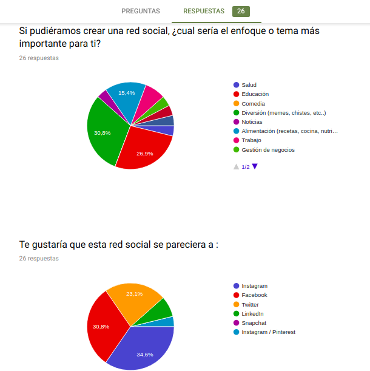
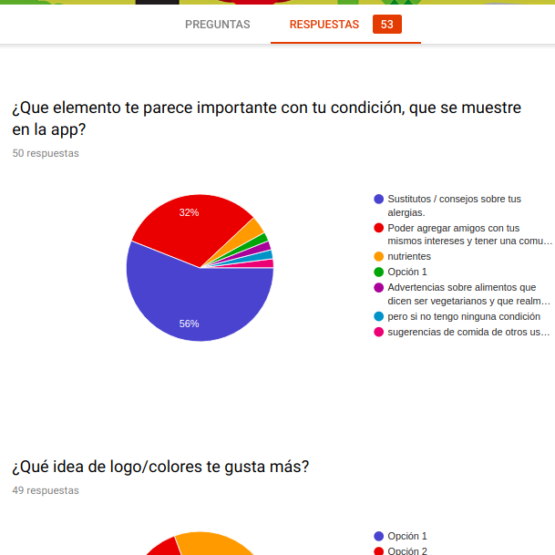
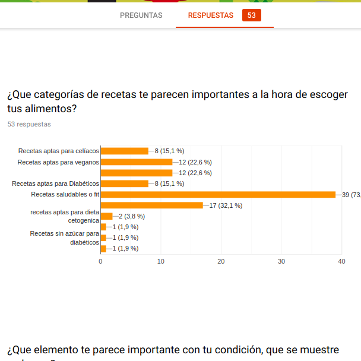
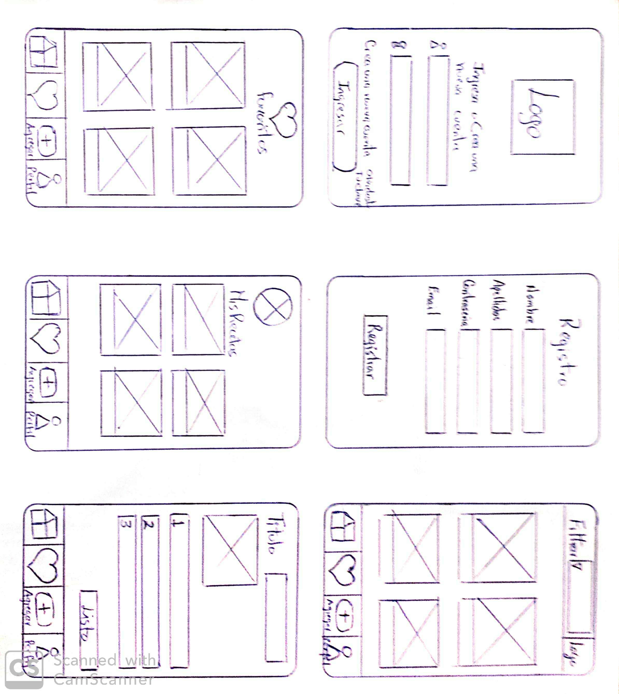

# AllergyBites

## **Descripción**

AllergyBites es una red social que da una plataforma para publicar y ver recetas e información sobre salud y alimentación, para todas aquellas personas que tengan algún problema con la alimentación o simplemente tengan habitos alimenticios específicos o diferentes.

## **Lenguajes y herramientas utilizadas en el código**

Todo el código fue realizado con Vanilla Javascript y CSS puro, no se utilizó ninguna librería o frameworks. 
Fue diseñado como 
* [Mobile first Design](https://www.mediaclick.es/blog/diseno-web-responsive-design-y-la-importancia-del-mobile-first/) 
* [Single page Application](https://es.wikipedia.org/wiki/Single-page_application) 

Testeado con
* [JEST](https://jestjs.io/)

## **Definición de usuario**

Se realizó una encuesta para poder conocer más sobre las preferencias de los usuarios al momento de necesitar una red social para sus mascotas. De el 100% de los encuestados, el 73% de ellos quiere encontrar el el sitio rcetas fit o saludables, el 22% están interesados en ver contenido sobre recetas aptas para veganos o vegetarianos, el 8% quiere ver recetas aptas para personas diabéticas y dentro de estas necesidades tambien encontramos ususrios que desean ver recetas aptas para personas con intolerancia a la a lactosa.

## **Necesidades del Usuario**

* Poder ingresar en una red social parecida a imstagram.
* // que se adapte a sus necesidades alimenticias.
* // poder subir información sobre recetas aptas para todos aquellos con necesidades especiales.
* // poder acceder a recetas aptas para ellos.

## **Historias de Usuario:**

## 1 
 https://trello.com/c/8aBzbMhy

## 2
 https://trello.com/c/uEUaaiEg

## 3
 https://trello.com/c/sKYpbDqK

## 4
 https://trello.com/c/rPHkDMPB

 ## 5
 https://trello.com/c/9K69yN8g
 
 ## 6
 https://trello.com/c/Kdnpw4Ua
 
 ## 7
 https://trello.com/c/9MJOelZF

 ## **Prototipo de Baja Fidelidad** 

Se realizó un sketch con papel y lápiz tratando de mostrar los resultados obtenidos con todos los requerimientos que recabamos.

 El prototipo de esta página consta de 6 pantallas. La primera es donde el usuario inicia su sesión, la cual puede ser con una cuenta creada desde la aplicación con su email y contraseña o mediante su cuenta Google, si no esta registrado y no quiere iniciar sesión desde Google, hay un link que dice "registrate aquí" y se abre otra pantalla donde puede ingresar sus datos y crear su cuenta con clave.

Una vez registrado o iniciado sesión se abre otra pantalla de nuestra red social, donde puede ver las publicaciones de otros usuarios. En la parte superior hay un buscador donde damos la opción al usuario de filtrar las recetas de su interés. Los post se pueden comentar, dar "likes", eliminarlos y editarlos, lo mismo para los comentarios. En la parte inferior aparecen cuatro imágenes/símbolos: "home" (damos la opción de volver al inicio de las publicaciones), "corazón" (que lleva a la pantalla de favoritos), "+/ agregar" (con este símbolo se puede crear un post) y "perfil una persona" (al hacer "click" se despliega una pantalla donde puede ver su perfil).

Al hacer "click" en iniciar sesión, aparece otra pantalla donde se puede hacer una publicacion, donde podra colocar el nombre de su receta, el tiemṕo que tarda en realizarse la receta, los ingredientes, la preparación, tiene la opcion de subir una imagen de su platillo y por ultimo puede subir su receta.

 

## **Prototipo de Alta Fidelidad**

 Se desarrolló un prototipo en Figma, el cual permitió imitar el aspecto y el comportamiento de una interfaz real.
 Se puede ver el prototipo directamente en el link:

https://www.figma.com/proto/twBVSXlWjBVOt0VIBjHZWm/Social-Network?node-id=207%3A14&scaling=scale-down

### **Testeos de Usabilidad**
Por cada historia de usuario terminada se recibió feedback de distintas personas y se grabaron algunas con Loom utilizando nuestro prototipo de alta fidelidad:

https://www.useloom.com/share/6e2a1b96a498427f88d284e556276c96

### **Planificación en Trello**

Para planificar y coordinar el trabajo se utilizó Trello
la cual se puede ver en siguiente link:

https://trello.com/b/0UWGSXXH/proyecto-3-red-social
